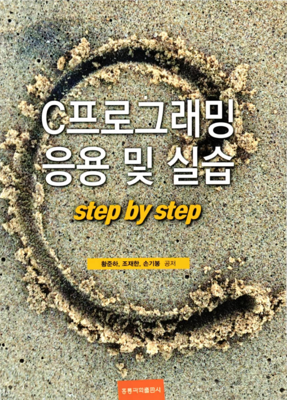

# C프로그래밍 응용 및 실습

## 목차

   * 1주차. C 프로그래밍 기초
   * 2주차. 데이터 저장
   * 3주차. 제어문
   * 4주차. 함수
   * 5주차. 라이브러리 함수
   * 6주차. 배열
   * 7주차. 포인터 기초
   * 8주차. 토인터 활용(1)
   * 9주차. 포인터 활용(2)
   * 10주차. 문자열 처리
   * 11주차. 구조체
   * 12주차. 파일 처리
   * 13주차. 다중파일 프로그래밍

